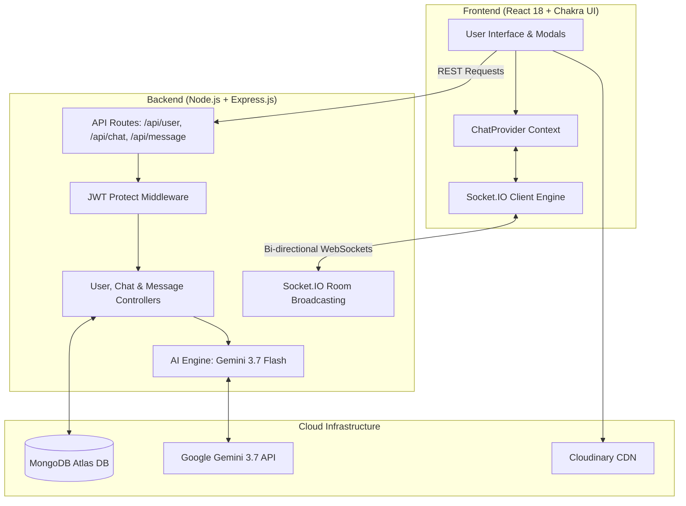

# 💬 Ellkay — Intelligent Real-Time Collaboration & AI Chat Platform

> **Live Application:** [https://linkify-1q81.onrender.com](https://linkify-1q81.onrender.com)  
> **Built with:** MERN Stack (MongoDB, Express.js, React 18, Node.js) • Socket.IO • Google Gemini 3.7 Flash • Chakra UI • Cloudinary

---

## 💡 Why "Ellkay"?

**Ellkay** (`L.K.`) stands for **"Listen & Know"**:
* **`L` — Listen:** The platform seamlessly connects users and actively *listens* to the flow of team discussions and message streams.
* **`K` — Know:** Powered by generative AI, it transforms chaotic message threads into structured, actionable *knowledge*—allowing you to know the summary, decisions, and next steps in seconds.

*(It is also a subtle tribute to the creator's initials and signature project branding).*

---

## 🎯 The 2 Real-World Problems Ellkay Solves

Modern chat apps create digital fatigue and conversational friction. **Ellkay** directly solves the two biggest pain points in team and group communications using **Google Gemini 3.7 Flash AI**:

```
┌────────────────────────────────────────────────────────────────────────────────────────┐
│  🔴 PROBLEM 1: Group Chat Fatigue & Information Overload                                │
│  "You open a group chat with 100+ unread messages and don't feel like reading it all."   │
├────────────────────────────────────────────────────────────────────────────────────────┤
│  ✅ ELLKAY SOLUTION: 1-Click "Catch Up (AI)" Summarizer                                │
│  Instead of scrolling through walls of text, click "✨ Catch Up (AI)" to get an        │
│  instant executive summary, key topics, decisions made, and an action item checklist.  │
└────────────────────────────────────────────────────────────────────────────────────────┘

┌────────────────────────────────────────────────────────────────────────────────────────┐
│  🔴 PROBLEM 2: Reply Paralysis & Conversational Block                                  │
│  "You don't know what to reply, need a professional draft, or need fast technical help."│
├────────────────────────────────────────────────────────────────────────────────────────┤
│  ✅ ELLKAY SOLUTION: Context-Aware In-Chat AI Assistant (`@ai`)                         │
│  Simply type `@ai <prompt>` inside any chat. Ellkay AI reads recent context to suggest │
│  smart replies, brainstorm solutions, or draft messages without leaving the chat.      │
└────────────────────────────────────────────────────────────────────────────────────────┘
```

---

## ✨ Core Features

### 🤖 1. AI Intelligence Engine (Google Gemini 3.7 Flash)
* **✨ "Catch Up (AI)" Conversation Breakdown:**
  * **Executive Overview:** 1–2 crisp sentences capturing the essence of the discussion.
  * **Key Discussion Topics:** Tagged overview of what people talked about.
  * **Decisions Made:** Explicit log of agreements and choices made in the thread.
  * **Action Items Checklist:** Extract tasks, assignments, and follow-ups.
  * **Conversation Sentiment:** Evaluates tone (e.g., *Productive*, *Planning*, *Casual*, *Urgent*).
  * **1-Click Copy:** Export the full summary to clipboard formatted for Slack/Notion/Email.
* **💬 In-Chat AI Assistant (`@ai` / `@bot`):**
  * Type `@ai how should we respond to this client request?` or `@ai summarize what we agreed on`.
  * The bot automatically reads recent chat history, formulates an intelligent response, and posts as **`Ellkay AI ✨`** in real time.
* **🛡️ Multi-Model Failover Resilience:**
  * Uses automated fallback architecture (`gemini-3.7-flash` ➔ `gemini-3.6-flash` ➔ `gemini-3.5-flash-lite`) ensuring 100% AI uptime.

### ⚡ 2. Real-Time Communication (Socket.IO)
* **Instant Bi-Directional Messaging:** Zero-reload live message delivery across 1-on-1 and group chats.
* **Live Unread Badges:** Unread message count badges (`1 new`, `3 new`) displayed dynamically on sidebar chat cards and the top notification bell.
* **Typing Indicators:** Animated real-time "user is typing..." indicator using Lottie animations.
* **Global Persistent Socket:** Architecture ensures incoming notifications are caught anywhere in the application.

### 👥 3. Group Chat & User Management
* **Dynamic Group Creation:** Search and add multiple users to create rich group conversations.
* **Group Administration:** Rename group chats, add members, or remove participants with admin validation.
* **User Search:** Real-time search by user name or email address.

### 📸 4. Profile & Media Management
* **Change Profile Picture:** Upload photos directly from device (`JPEG`, `PNG`, `WEBP`) to **Cloudinary** cloud storage or paste direct web URLs.
* **Instant Persistence:** Profile updates synchronize across all headers, active chats, and message bubbles immediately.

### 🔒 5. Security & Authentication
* **JWT Authentication:** Secure token-based user verification with custom middleware (`authmiddleware.js`).
* **Bcrypt Password Encryption:** Passwords hashed with 10 salt rounds before database storage.
* **Instant Guest Access:** Pre-configured Guest Login button for one-click reviewer and interviewer walkthroughs.

---

## 🛠️ Tech Stack & Architecture

### **Frontend**
* **React 18** — Component-driven Single Page Application
* **Chakra UI** — Modern, accessible, dark/light responsive interface
* **Socket.IO Client** — Real-time event subscription and emission
* **Axios** — HTTP client for RESTful API communication
* **React Router v5** — Declarative client-side routing
* **React Scrollable Feed & Lottie** — Auto-scrolling chat feeds & smooth typing animations

### **Backend**
* **Node.js & Express.js** — Fast, robust REST API & WebSocket server
* **Socket.IO Server** — Multi-room broadcasting and user room management
* **Google Gemini API (`@google/genai`)** — State-of-the-art LLM for chat intelligence
* **MongoDB Atlas & Mongoose** — Cloud document database with relational referencing & deep population
* **JWT (JSON Web Tokens)** — Stateless session management
* **Bcrypt.js** — Cryptographic password hashing
* **Cloudinary API** — Cloud image and avatar storage

---

## 🏛️ System Architecture Diagram



---

## 📂 Project Structure

```
MERN-CHAT-APP/
├── backend/
│   ├── config/             # DB connection & JWT token generator
│   ├── controllers/        # Business logic (user, chat, message)
│   ├── middleware/         # JWT auth middleware & error handlers
│   ├── Models/             # Mongoose schemas (User, Chat, Message)
│   ├── routes/             # Express API routes
│   ├── services/           # AI service (Gemini 3.7 Flash integration)
│   └── server.js           # Express app & Socket.IO server initialization
├── frontend/
│   ├── public/             # HTML template & assets
│   └── src/
│       ├── animations/     # Lottie JSON animations
│       ├── components/     # ChatBox, MyChats, Modals, Authentication
│       │   ├── authentication/
│       │   └── miscallaneous/
│       ├── config/         # Sender & chat helper utilities
│       ├── Context/        # Global ChatProvider & Socket context
│       ├── Pages/          # Homepage & ChatPage views
│       ├── App.js          # App component & theme
│       └── index.js        # React DOM root
├── .env.example            # Environment variable template
└── package.json            # Root scripts & dependencies
```

---

## 🚀 Getting Started Locally

### 1. Prerequisites
* [Node.js](https://nodejs.org/) (v16+ recommended)
* [MongoDB Atlas](https://www.mongodb.com/cloud/atlas) account
* [Google AI Studio](https://aistudio.google.com/) Gemini API Key
* [Cloudinary](https://cloudinary.com/) account (for image uploads)

### 2. Clone the Repository
```bash
git clone https://github.com/AnanyaKastiya/Ellkay-AI-Chat-Platform.git
cd Ellkay-AI-Chat-Platform
```

### 3. Configure Environment Variables
Create a `.env` file in the root directory:
```env
PORT=5000
MONGO_URI=your_mongodb_connection_string
JWT_SECRET=your_jwt_secret_key
NODE_ENV=development
GEMINI_API_KEY=your_google_gemini_api_key
```

### 4. Install Dependencies & Run
```bash
# Install root & frontend dependencies
npm run build

# Start backend & frontend concurrently in development mode
npm run start
```
Open **`http://localhost:3000`** in your browser.

---

## 👩‍💻 Author
**Ananya Kastiya**  
GitHub: [@AnanyaKastiya](https://github.com/AnanyaKastiya)  
Live Demo: [https://linkify-1q81.onrender.com](https://linkify-1q81.onrender.com)
